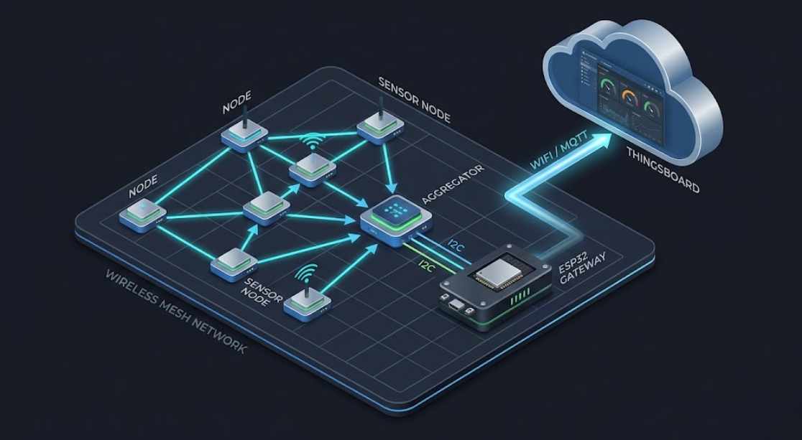
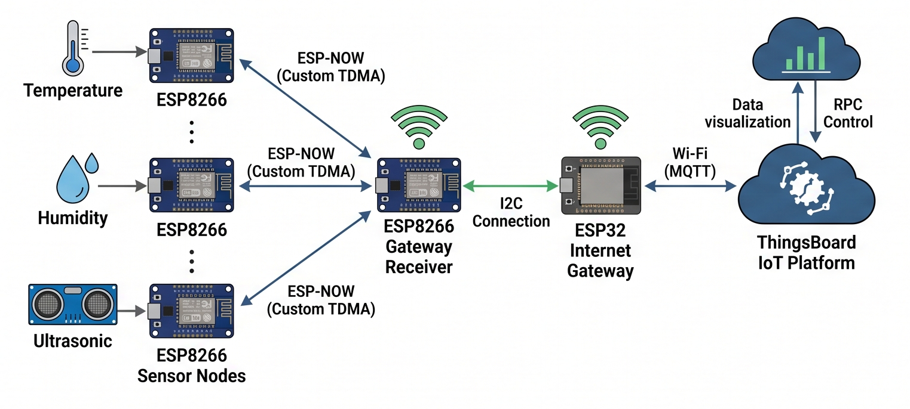
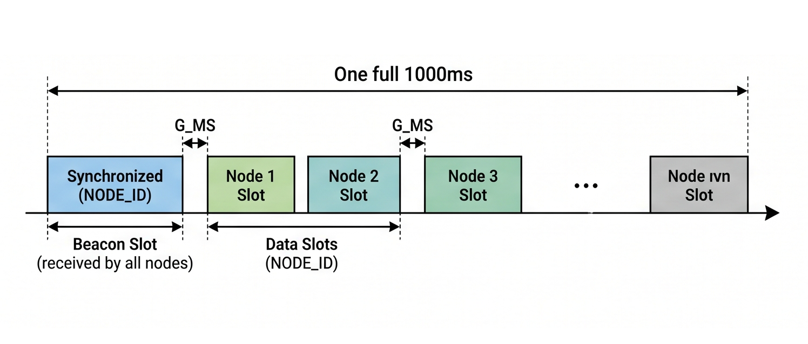
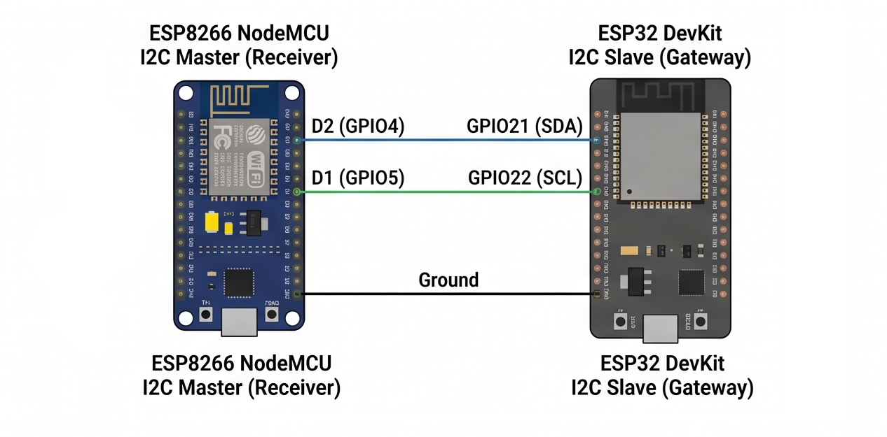
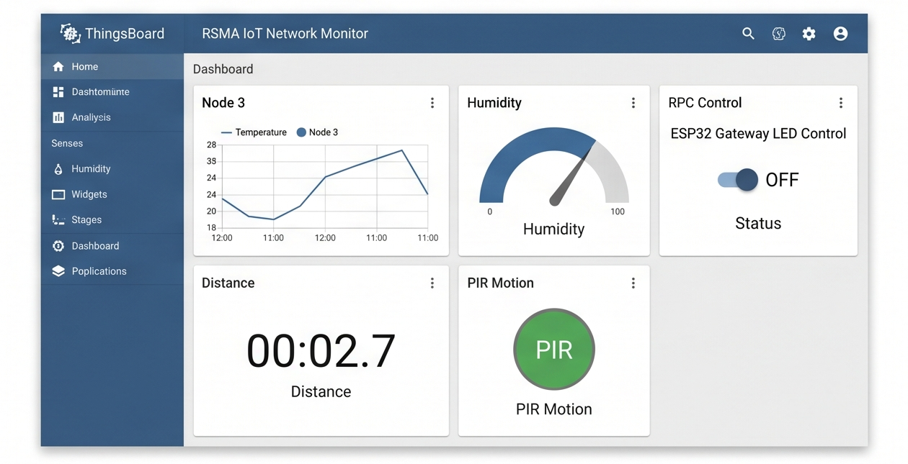

# ESP-NOW IoT Sensor Network with TDMA Routing & ThingsBoard 🌐📡

A multi-node IoT sensor network built with ESP8266 and ESP32, featuring custom TDMA scheduling, multi-hop ESP-NOW routing, and real-time cloud monitoring via ThingsBoard.

<div align="center">
  
</div>

<br>
<div align="center">
  <a href="https://codeload.github.com/TendoPain18/esp-now-iot-sensor-network/legacy.zip/main">
    
  </a>
</div>

## 📋 Description

This project implements a complete IoT wireless sensor network from the physical layer up to a cloud dashboard. Multiple ESP8266 sensor nodes communicate wirelessly using the ESP-NOW protocol under a custom Time Division Multiple Access (TDMA) schedule. A dedicated gateway node bridges the wireless network to an ESP32 over I2C, which then publishes per-node telemetry to the ThingsBoard IoT platform via MQTT over WiFi.

The system supports multi-hop routing, automatic parent selection based on RSSI path metrics, packet de-duplication, CRC validation, and remote LED actuation via ThingsBoard RPC commands.

## ✨ Features

- **Custom TDMA Scheduling**: 1-second frames divided into beacon and per-node data slots with configurable guard intervals
- **Multi-Hop ESP-NOW Routing**: Nodes relay packets toward the gateway using a path-sum RSSI metric, with loop prevention via path tracking and de-duplication
- **Neighbor Discovery**: Periodic Hello messages carry RSSI and routing metrics for dynamic parent selection
- **Sensor Fusion**: Each node reports ultrasonic distance (HC-SR04), temperature, humidity, and PIR motion detection
- **I2C Bridge**: CRC16-validated structured packets transfer data from the ESP8266 gateway to the ESP32
- **ThingsBoard Integration**: The ESP32 publishes per-node telemetry keys (e.g. `id3_US`, `id3_T`) and handles RPC `setLed` commands
- **Actuation**: Gateway LED (D5) automatically activates when Node 3 detects an object closer than 20 cm
- **Robust Communication**: CRC16 packet integrity checking, sequence-number de-duplication, and automatic WiFi/MQTT reconnection

## 🏗️ System Architecture

<div align="center">
  
</div>

The network consists of three logical roles:

**Sensor Nodes (ESP8266 — NodeMCU v2)**
Each node runs the ESP-NOW sniffer in promiscuous mode to receive gateway beacons and neighbor Hello messages. Nodes generate sensor payloads every 500 ms and transmit buffered data packets during their assigned TDMA slots. Nodes 3 and 9 use a real HC-SR04 ultrasonic sensor; Node 7 uses simulated sinusoidal sensor data.

**Gateway Node (ESP8266 — NodeMCU v2)**
Broadcasts TDMA beacon frames every second, receives data packets from sensor nodes over ESP-NOW, maintains a routing table of all known nodes, controls a local LED based on Node 3 ultrasonic readings, and forwards received data to the ESP32 over I2C.

**Cloud Gateway (ESP32)**
Acts as an I2C slave and MQTT client. It receives structured I2CPacket frames from the gateway NodeMCU, validates CRC, parses sensor fields, and publishes per-node telemetry to ThingsBoard. It also subscribes to RPC topics to handle remote LED control commands.

## 📡 TDMA Frame Structure

<div align="center">
  
</div>

Each 1000 ms frame is structured as follows:

- **Beacon Slot**: Gateway broadcasts synchronization beacon (with frame sequence and epoch)
- **Data Slots**: `N × m` slots (N = 10 max nodes, m = 2 sub-slots each), assigned round-robin per node ID
- **Guard Intervals**: 3 ms pre/post guards per slot to prevent collisions

Each node owns slots `1 + k × N + (nodeId − 1)` for `k = 0..m−1`. Nodes wake precisely for their slots using beacon-anchored frame synchronization.

| Parameter | Value |
|-----------|-------|
| Frame duration | 1000 ms |
| Max nodes | 10 |
| Sub-slots per node | 2 |
| Guard interval (G) | 3 ms |
| TX window per slot | slotMs − 2G |

## 🔗 I2C Connection

<div align="center">
  
</div>

The ESP8266 gateway acts as I2C master and the ESP32 acts as slave at address `0x08`.

**I2C Packet Structure (`I2CPacket`):**
```
| Preamble (0xBEEF) | Length | Seq | SrcId | HopCount | Text[32] | CRC16 |
```

The CRC16-CCITT is computed over all fields except the CRC field itself. The ESP32 validates the preamble and CRC before processing any packet.

## ☁️ ThingsBoard Dashboard

<div align="center">
  
</div>

Telemetry is published to `demo.thingsboard.io` using the device access token. Each sensor node's data is keyed by node ID (e.g., `id3_US`, `id3_T`, `id3_H`, `id7_PIR`) so all nodes appear on a single device dashboard. The ESP32 LED state is also published as `esp32_led`.

**RPC Support**: The ThingsBoard dashboard can send `setLed` RPC commands to toggle the ESP32 onboard LED and receives a JSON acknowledgment response.

## 🔧 Hardware

| Component | Role | Quantity |
|-----------|------|----------|
| ESP8266 NodeMCU v2 | Sensor nodes + gateway | 4 |
| ESP32 Dev Module | Cloud gateway (I2C slave + MQTT) | 1 |
| HC-SR04 Ultrasonic Sensor | Distance measurement (Nodes 3, 9) | 2 |
| PIR Sensor | Motion detection | 1+ |
| LED | Gateway actuation indicator | 1 |

**Gateway I2C Pins (NodeMCU → ESP32):**
- SDA: D2 (GPIO4) → ESP32 GPIO21
- SCL: D1 (GPIO5) → ESP32 GPIO22

## 🚀 Getting Started

**Arduino Libraries Required:**
- `ESP8266WiFi`, `espnow` (ESP8266 boards package)
- `WiFi`, `Wire`, `PubSubClient`, `ArduinoJson` (ESP32)

**Setup Steps:**

1. Flash `iot_project_gateway.ino` to the ESP32 after setting your WiFi credentials and ThingsBoard token
2. Flash `iot_project_rec.ino` to the designated gateway NodeMCU
3. Flash `iot_project_sen_1.ino`, `sen_2.ino`, `sen_3.ino` to each sensor NodeMCU (set `NODE_ID_CFG` per device)
4. Power on the ESP32 first, then the gateway NodeMCU, then sensor nodes
5. Monitor Serial at 115200 baud to observe routing table, slot sync, and I2C forwarding
6. Open your ThingsBoard device dashboard to view live telemetry

**Node ID Configuration:** Edit `#define NODE_ID_CFG` in each sensor sketch (1–10). Nodes with IDs 3 and 9 use the real HC-SR04 ultrasonic sensor; others use simulated data.

## 🤝 Contributing

Contributions are welcome! Feel free to add new sensor types, improve the routing metric, or expand the ThingsBoard dashboard.

## 🙏 Acknowledgments

- ThingsBoard open-source IoT platform
- PubSubClient and ArduinoJson libraries
- ESP-NOW and ESP8266/ESP32 Arduino core communities

<br>
<div align="center">
  <a href="https://codeload.github.com/TendoPain18/esp-now-iot-sensor-network/legacy.zip/main">
    
  </a>
</div>

## <!-- CONTACT -->
<div id="toc" align="center">
  <ul style="list-style: none">
    <summary>
      <h2 align="center">
        🚀
        CONTACT ME
        🚀
      </h2>
    </summary>
  </ul>
</div>
<table align="center" style="width: 100%; max-width: 600px;">
<tr>
  <td style="width: 20%; text-align: center;">
    <a href="https://www.linkedin.com/in/amr-ashraf-86457134a/" target="_blank">
      
    </a>
  </td>
  <td style="width: 20%; text-align: center;">
    <a href="https://github.com/TendoPain18" target="_blank">
      
    </a>
  </td>
  <td style="width: 20%; text-align: center;">
    <a href="mailto:amrgadalla01@gmail.com">
      
    </a>
  </td>
  <td style="width: 20%; text-align: center;">
    <a href="https://www.facebook.com/amr.ashraf.7311/" target="_blank">
      
    </a>
  </td>
  <td style="width: 20%; text-align: center;">
    <a href="https://wa.me/201019702121" target="_blank">
      
    </a>
  </td>
</tr>
</table>
<!-- END CONTACT -->

## **Connect your sensors to the cloud with reliable multi-hop IoT routing! 🌐✨**
